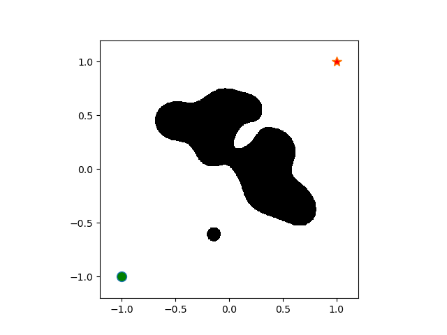
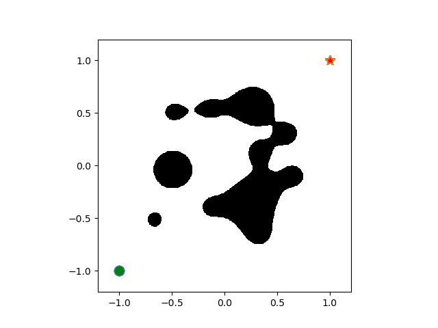
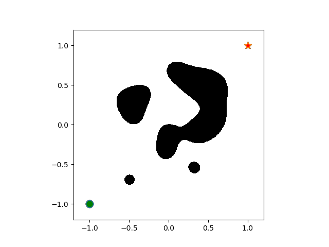
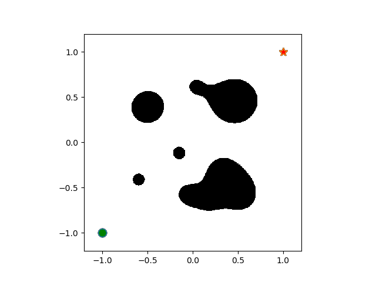
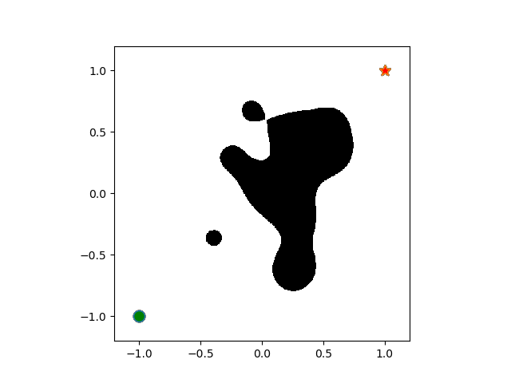

# Dynamic 2D Environment Generator

This is a 2D environment generator useful for random generation of random layouts in 2D.
The implementation has been inspired by the environment description as specified in 
[Appendix G of RoCUS](https://arxiv.org/pdf/2012.13615.pdf).
A few application where such an environment representation is useful are:
environments for robot 2D navigation, obstacle grids, random meshes, maze generation, etc. 

<!-- TOC -->
* [Dynamic 2D Environment Generator](#dynamic-2d-environment-generator)
  * [Environment Description](#environment-description-)
  * [Parameters](#parameters-)
  * [Requirements](#requirements)
      * [To use the environment description from the ```environment.py``` file, the following dependencies are required:](#to-use-the-environment-description-from-the-environmentpy-file-the-following-dependencies-are-required)
      * [Additional requirements to generate environments in bulk using the ```main.py``` file:](#additional-requirements-to-generate-environments-in-bulk-using-the-mainpy-file)
      * [The source has been tested with the following versions:](#the-source-has-been-tested-with-the-following-versions)
  * [Sample Environments Generated](#sample-environments-generated-)
    * [Parameters Used](#parameters-used)
      * [Offset 0:](#offset-0)
      * [Offset 20:](#offset-20)
      * [Offset 40:](#offset-40)
      * [Offset 60:](#offset-60)
      * [Offset 80:](#offset-80)
  * [Generated Environments](#generated-environments-)
<!-- TOC -->

## Environment Description ##

The environment is the area defined in the domain of (xmin, xmax) × (ymin, ymax) along with
starting point (xstart, ystart) and ending point (xgoal, ygoal). The environment representation is a
summation of radial basis function (RBF) kernels centered "obstacle points" that are randomly generated 
based on a seed value. Specifically, given n obstacle points $p_{1}, p{2}, ..., p{n} ∈ R^2$,
the environment is defined at each point in the domain R^2 (within limits) as:

$$e(P) = \sum_{i=1}^{n} \exp(-\gamma || P - P_{i} ||_{2}^2)$$

A point P in the limits of the environment (xmin, xmax) × (ymin, ymax) is an obstacle if $e(P) > \eta$.
Note: the environment is a continuous space and not discretized. The environment needs a
resolution if it is to be discretized into a configuration space.

## Parameters ##
```
- environment_range: (min limit, max limit) : the limits of the square environment.

- obstacle_point_range: (min limit, max limit) : points in the grid that can be obstacles.

- start_point: (start x, start y) : starting point in the environment.

- end_point: (end x, end y) : ending point in the enviropnment.

- obstacle_points: int ∈ (0, inf) : number of "obstacle points" for the kernel.

- eta: float : threshold (min weight) for classifying point as an obstacle.

- grid_resolution: int : resolution of grid for discretization.

- seed: int : a seed value for the psrng to generate the "obstacle points" kernels.

- gamma: int : weight for the RBF kernel.
```

## Requirements
#### To use the environment description from the [```environment.py```](src/environment.py) file, the following dependencies are required:
```
numpy
matplotlib
```
#### Additional requirements to generate environments in bulk using the [```main.py```](src/main.py) file:
```
tqdm
```
Execute the main file using the command ```python main.py``` from src as the working directory. <br/>
Note: make sure that the output file path exits.

#### The source has been tested with the following versions:
```
matplotlib==3.1.2
numpy==1.17.4
tqdm==4.64.1
```
Install all requirements using ```pip install -r requirements.txt``` from project source.

## Sample Environments Generated ##

### Parameters Used

```
environment_range = (-1.2, 1.2)
obstacle_point_range = (-0.7, 0.7)
start_point = (-1, -1)
end_point = (1, 1)
obstacle_points = 15
eta = 0.9
grid_resolution = 500
seed = 1337 + offset (offset is set as per the image number)
gamma = 25
```

#### Offset 0:


#### Offset 20:


#### Offset 40:


#### Offset 60:


#### Offset 80:


## Generated Environments ##
An archive of 5000+ environment layouts generated using the parameters listed above can be found at [this](https://drive.google.com/drive/folders/1xtusEuXeP_PbV9WKFjP3LQ33hYFS6LJq?usp=sharing) link.
